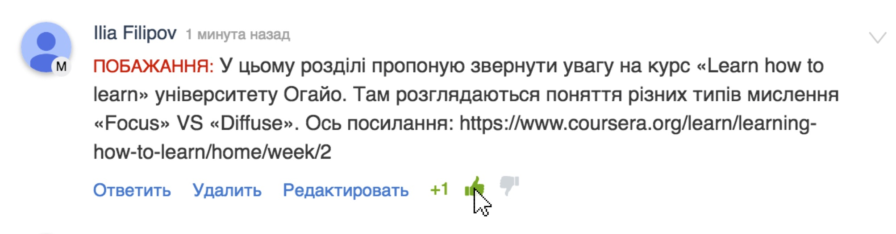

# Зміст розділу
1. [Звернення до громадськості](#zvernennya)
2. [Інструкція з використання](#instruction)
3. [Вступне опитування](#vstup)
4. [Програма з англійської мови для спеціалізованих навчальних закладів із поглибленим вивченням іноземних мов](#programa)

Звернення до громадськості {#zvernennya}
--

Вітаємо на проекті відкритого обговорення програми з англійської мови для спеціалізованих навчальних закладів із поглибленим вивченням іноземних мов.

Інструкція з використання платформи {#instruction}
--
У даному відеофрагменті ми розповімо у чому полягає суть проекту та як використовувати функціонал платформи для відкритих обговорень програм.

<iframe align="center" width="560" height="315" src="https://www.youtube.com/embed/V_Cii41-v-w" frameborder="0" allowfullscreen></iframe>

Звертаємо вашу увагу на систему голосування у коментарях. Чим більше позитивних відгуків стосовно коментаря, тим швидше модератори звернуть на нього увагу і зроблять акцент, щоби більше людей змогли одразу ознайомитися з корисною інформацією. Також найбільш позитивні коментарі будуть розглядатися у першу чергу експертною комісією.

Не забувайте, що на платформі заборонені образи, порушення прав і свобод громадян України, нецензурна лексика.

Вступне опитування {#vstup}
--
У попередньому пункті ви ознайомилися з функціоналом платформи та суттю проекту публічних обговорень програм для молодшої школи. Для нас дуже важливо, аби ви висловились стосовно запропонованої ідеї та відповіли на декілька запитань перед початком роботи з програмою. Пройдіть, будь ласка, вступне опитування. Його результати допоможуть нам покращувати українську освіту разом, у найбільш ефективний спосіб. 

Зміст програми {#programa}
--
* [Пояснювальна записка](poyasnuvalna_zapyska.md)
* [1 клас](1/1_klas.md)
   * [Лінгвістична компетенція](1/lyngvystykhna_kompetenzia.md)
   * [Соціокультурна компетенція](1/soziokulturna_kompetenzia.md)
   * [Загальнонавчальна компетенція](1/zagalnonavchalna_kompetenzya.md)
   * [На кінець 1-го класу](1/na_kynec_1_klasu_uchny_povunny_vmyty.md)
       * [Аудіювання](1/audiyuvannya.md)
       * [Говоріння](1/govorinnya.md)
       * [Читання](1/chitannya.md)
       * [Письмо](1/pysmo.md)
* [2 клас](2/2_klas.md)
   * [Лінгвістична компетенція](2/lyngvystykhna_kompetenzia.md)
   * [Соціокультурна компетенція](2/soziokulturna_kompetenzia.md)
   * [Загальнонавчальна компетенція](2/zagalnonavchalna_kompetenzya.md)
   * [На кінець 2-го класу](2/na_kynec_2_klasu_uchny_povunny_vmyty.md)
       * [Аудіювання](2/audiyuvannya.md)
       * [Говоріння](2/govorinnya.md)
       * [Читання](2/chitannya.md)
       * [Письмо](2/pysmo.md)
* [3 клас](3/3_klas.md)
   * [Лінгвістична компетенція](3/lyngvystykhna_kompetenzia.md)
   * [Соціокультурна компетенція](3/soziokulturna_kompetenzia.md)
   * [Загальнонавчальна компетенція](3/zagalnonavchalna_kompetenzya.md)
   * [На кінець 3-го класу](3/na_kynec_3_klasu_uchny_povunny_vmyty.md)
       * [Аудіювання](3/audiyuvannya.md)
       * [Говоріння](3/govorinnya.md)
       * [Читання](3/chitannya.md)
       * [Письмо](3/pysmo.md)
* [4 клас](4/4_klas.md)
   * [Лінгвістична компетенція](4/lyngvystykhna_kompetenzia.md)
   * [Соціокультурна компетенція](4/soziokulturna_kompetenzia.md)
   * [Загальнонавчальна компетенція](4/zagalnonavchalna_kompetenzya.md)
   * [На кінець 4-го класу](4/na_kynec_4_klasu_uchny_povunny_vmyty.md)
       * [Аудіювання](4/audiyuvannya.md)
       * [Говоріння](4/govorinnya.md)
       * [Читання](4/chitannya.md)
       * [Письмо](4/pysmo.md)

<a href="http://hypercomments.com" class="hc-link" title="comments widget">comments powered by HyperComments</a>

